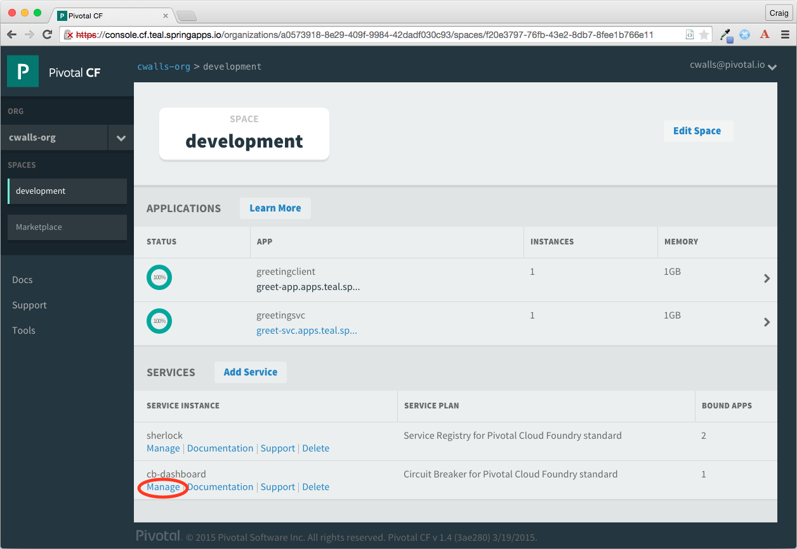
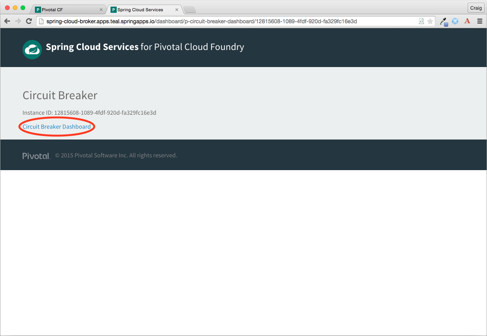
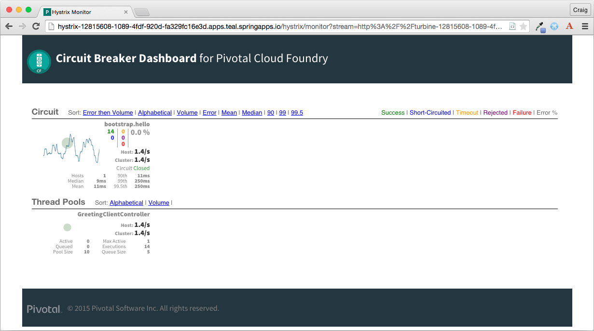
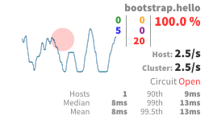

:toc:
:icons: font
:source-highlighter: prettify
:project_id: gs-circuit-breaker
This guide walks you through the process of instrumenting a simple "hello world" REST client with a circuit breaker and viewing the circuit breaker's details in Pivotal Cloud Foundry's circuit breaker dashboard.

== What you'll build

You'll deploy the simple "hello world" REST service created at http://spring.io/guides/gs/rest-service/[Building a RESTful Web Service] to Pivotal Cloud Foundry, register it to a Eureka service instance. Then you'll instrument a client of that service with a circuit breaker and see how the circuit breaker handles failure.

== What you'll need

include::https://raw.githubusercontent.com/pcf-guides/getting-started-macros/master/prereq_editor_jdk_buildtools.adoc[]

[[initial]]
== Enable the discovery client

Starting with the Eureka-enabled "hello world" example from link:/guides/gs/gs-service-registry[Registering and Discovering Services], you'll start by adding a circuit breaker to the client code.

First, modify the Maven POM, adding the starter dependencies for Hystrix and Hystrix AMQP:

`pom.xml`
[source,xml]
----
include::complete/greeting-client/pom.xml[tag=dependencies]
----


The Spring Cloud Hystrix starter adds the Hystrix circuit breaker library to the project so that methods can be designated as being protected by a circuit breaker. The Spring Cloud Hystrix AMQP starter adds support for publishing circuit breaker metrics via AMQP for display in the circuit breaker dashboard.

Next, you'll need to enable the circuit breaker capability by annotating `DemoApplication` with `@EnableCircuitBreaker`.

`src/main/java/hello/DemoApplication.java`
[source,java]
----
include::complete/greeting-client/src/main/java/hello/DemoApplication.java[]
----

The `@EnableCircuitBreaker` annotation enables Hystrix beans in the application that support circuit breaker behavior. This will enable you to annotate methods with `@HystrixCommand` to designate them as being protected by a circuit breaker. 

As an example, the `hello()` method in `GreetingClientController` makes a REST call to the greeting service. If the service is unavailable, the `hello()` method could fail. To protect the method, annotate it with `@HystrixCommand`:

`src/main/java/hello/GreetingClientController.java`
[source,java]
----
include::complete/greeting-client/src/main/java/hello/GreetingClientController.java[tag=helloMethod]
----

The `fallbackMethod` attribute in `@HystrixCommand` specifies that if the `hello()` method fails, the fallback `goodbye()` method should be called instead. Add the following `goodbye()` method to `GreetingClientController`:

`src/main/java/hello/GreetingClientController.java`
[source,java]
----
include::complete/greeting-client/src/main/java/hello/GreetingClientController.java[tag=goodbyeMethod]
----

It's important that the signature of the fallback method that of the protected method (except for the method name). In this case, neither method has any arguments and both return `String`, so their signatures are a match. 

That's all of the changes necessary to enable the "hello world" client for circuit breaker protection. Next you'll deploy the service to Pivotal Cloud Foundry and bind it to the Circuit Breaker Dashboard service.


== Deploy the client to Cloud Foundry

Before you can deploy the service, you'll need to build it:

```sh
mvn package
```

Once the application has been built, you can deploy it to Cloud Foundry using the Cloud Foundry command line interface (cf CLI):

```sh
cf push greetingclient -p target/gs-rest-service-0.1.0.jar --random-route
```

Here the application is given the name "greetingclient" in Cloud Foundry, the same name used in /gs-service-registry[Registering and Discovering Services]. You are welcome to name it whatever you wish, but remember the name, because you'll need it when you bind the application to the Circuit Breaker Dashboard service. 


Next you'll create an instance of the Circuit Breaker Dashboard service. This service is known as "p-circuit-breaker-dashboard" in the service marketplace and only offers a single service plan named "standard". Using the cf CLI, create an instance of the service named "cb-dashboard":

```sh
cf create-service p-circuit-breaker-dashboard standard cb-dashboard
```

Now you can bind the Circuit Breaker Dashboard service instance to the application:

```sh
cf bind-service greetingclient cb-dashboard
cf restage greetingclient
```

Note that it's important to restage the application after binding the service so that the environment variables pertaining to the service binding are reflected in the application.

At this point you should have both a "hello world" REST service deployed to Cloud Foundry and a client of that service, instrumented with a circuit breaker and also deployed and bound to the Circuit Breaker Dashboard service. Now you're ready to try it out by visiting the path "/hello" at the domain that the application is bound to:

```sh
curl http://greetingclient-envious-intima.lion.wild.cf-app.com/hello
```

Assuming that the greeting service application is running, the response should be "Hello, World!". 

Now stop the greetingsvc application:

```sh
cf stop greetingsvc
```

With the greeting service unable to response to requests from the client, the `hello()` method in `GreetingClientController` will fail. The circuit breaker will detect the failure and the `goodbye()` method will be called instead. If you restart the greetingsvc application, the original behavior will resume.

== Viewing the Circuit Breaker Dashboard

In addition to offering failover behavior, circuit breakers also publish a stream of metrics concerning the health of the protected methods. You can view this information in the circuit breaker dashboard.

To view the circuit breaker dashboard, sign into the Cloud Foundry console application and click on the "Manage" link below the "cb-dashboard" service:



The management dashboard for the service instance will appear: 



Click on the "Circuit Breaker Dashboard" link to bring up the Circuit Breaker Dashboard:



In the dashboard, you'll see only one circuit breaker--the one for the `hello()` method. If there were more circuit breaker protected methods in greetingclient or any other application bound to the Circuit Breaker Dashboard service they would appear here, too.

When the method is operating normally, the circuit will be closed. However, when the method starts to fail, the circuit will be thrown open and will appear something like this:



The circuit breaker dashboard becomes more interesting as circuit breaker protected methods are called and either succeed or fail. For the best demonstration of the dashboard, try creating a lot of traffic for the `hello()` method and occasionally stop and start the greetingsvc application.


== Summary

Congratulations! You have just enabled circuit breaker protection in a REST service and viewed its status in the Circuit Breaker Dashboard in Cloud Foundry. 
